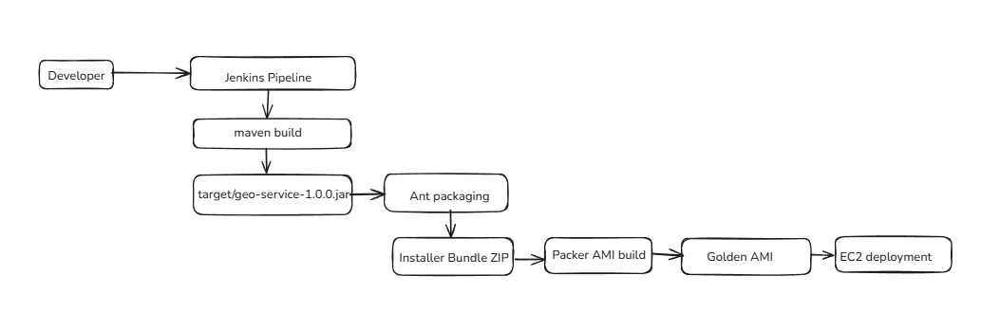

# Geo Service – End-to-End Build & Deployment Automation Framework

A Java-based Spring Boot REST service with a **complete enterprise-style build, packaging, and deployment pipeline**, implemented using Maven, Ant, Jenkins, Docker, and Packer for AWS AMI creation and EC2 deployment.

---


## Project Overview

This project demonstrates the **design and implementation of a full build and deployment framework** for a Java application, closely reflecting real-world **Build & Release Engineering** and **DevOps** responsibilities.

This project demonstrates a full build and deployment pipeline for a Spring Boot REST service that provides geolocation endpoints. The service can be built as a JAR, packaged in Docker, and deployed as a golden AMI on AWS.

The solution automates the **entire software delivery lifecycle** — from source code build and dependency management to image creation, cloud deployment, and operational monitoring — using industry-standard tools and best practices.

The project is intentionally designed to support **multiple build systems and deployment models**, enabling flexibility across environments and aligning with enterprise software delivery requirements.

---

## API Endpoints

- `GET /health` - Returns `OK` health check
- `GET /location?lat=<latitude>&lon=<longitude>` - Returns location data in JSON format

## Prerequisites

Ensure you have the following installed locally:

- **Java 17** (or Java 11)
- **Maven** 3.6+
- **Apache Ant** 1.10+
- **Git**
- **Docker Desktop**
- **Jenkins** (local installation or EC2 instance)
- **AWS CLI** (configured with credentials)
- **Packer** 1.8+


### Verify Installation

```bash
java -version
mvn -version
ant -version
git --version
docker --version
aws --version
packer version
```

## Project Structure

```
geo-service/
├── pom.xml                           # Maven build configuration
├── build.xml                         # Ant installer bundle creation
├── Jenkinsfile                       # Jenkins pipeline definition
├── README.md                         # This file
├── src/                              # Java source code
│   └── main/
│       ├── java/
│       └── resources/
├── docker/
│   └── Dockerfile                    # Docker image definition
├── packer/
|   └── files
|        └── geo-service.service
|   └── scripts
|        ├── install_java.sh
|        ├── install_node_exporter.sh
│        └── setup_geo_service.sh
    └── geo-service.pkr.hcl          # Packer AMI template

```
## Architecture Summary

**High-level workflow:**



1. Source code managed in Git  
2. Jenkins pipeline triggers on commit  
3. Maven builds and tests Spring Boot application  
4. Ant packages installer bundle with scripts  
5. Docker image created for container-based deployment  
6. Packer builds a Golden AMI embedding the application  
7. EC2 instances launched from AMI  
8. Application and system metrics exposed via Node Exporter  

---

## Key Capabilities

- Automated Java application builds using **Maven** and **Ant**
- CI/CD orchestration using **Jenkins pipelines**
- Artifact packaging as:
  - Executable JAR
  - Docker container
  - AWS Golden AMI
- Image-based deployments to **AWS EC2**
- Support for legacy and modern build frameworks
- Monitoring integration via **Node Exporter**
- Linux-based automation and scripting
- Reproducible, versioned, and auditable builds

---

## Step-by-Step Build Instructions

### Step 1: Build Java Service with Maven

Build the Spring Boot application:

```bash
mvn clean package
```

This creates: `target/geo-service-1.0.0.jar`

Run locally to test:

```bash
java -jar target/geo-service-1.0.0.jar
```

Test the endpoints:

```bash
curl http://localhost:8080/health
curl http://localhost:8080/location?lat=37.7749&lon=-122.4194
```

### Step 2: Create Installer Bundle with Ant

Package the application with installation scripts:

```bash
ant clean package
```

This creates `dist/geo-service-installer-bundle.zip` containing:

```
installer-bundle/
├── bin/
│   └── geo-service-1.0.0.jar
├── conf/
│   └── application.properties
└── scripts/
    ├── install.sh
    ├── uninstall.sh
    └── upgrade.sh
```

### Step 3: Build Docker Image

Build the Docker container:

```bash
docker build -t geo-service:1.0.0 -f docker/Dockerfile .
```

Run the container:

```bash
docker run -p 8080:8080 geo-service:1.0.0
```

Test the containerized service:

```bash
curl http://localhost:8080/health
```

### Step 4: Build Golden AMI with Packer

Initialize Packer:

```bash
packer init packer/
```

Build the AMI:

```bash
packer build packer/geo-service.pkr.hcl
```

This creates a versioned AMI like: `geo-service-ami-1.0.0-<git-sha>`

The AMI includes:
- Ubuntu base image
- Java 17 runtime
- Geo service JAR installed to `/opt/geo-service/`
- systemd service configured for auto-start
- CloudWatch or Node Exporter monitoring agent

### Step 5: Jenkins Pipeline

The Jenkins pipeline (`Jenkinsfile`) automates all build stages:

1. **Checkout** - Clone from Git
2. **Maven Build** - Compile and package JAR
3. **Test** - Run unit tests
4. **Ant Bundle** - Create installer bundle
5. **Docker Build** - Build container image
6. **Packer AMI** - Build golden AMI
7. **Archive** - Store artifacts


## AWS Deployment

Once the AMI is built, you can:

1. Launch EC2 instances from the golden AMI
2. The service auto-starts via systemd
3. Access the service on port 8080
4. Monitor via CloudWatch or your monitoring solution on 9100

## Development Workflow

1. Make code changes in `src/`
2. Test locally: `mvn clean package && java -jar target/geo-service-1.0.0.jar`
3. Commit to Git
4. Push to trigger Jenkins pipeline
5. Jenkins automatically builds JAR, Docker image, and AMI
6. Deploy AMI to AWS environments


## Conclusion

This project represents a **realistic, enterprise-grade build and release automation pipeline**, demonstrating skills directly applicable to Build Engineering, DevOps, and CI/CD-focused roles.


